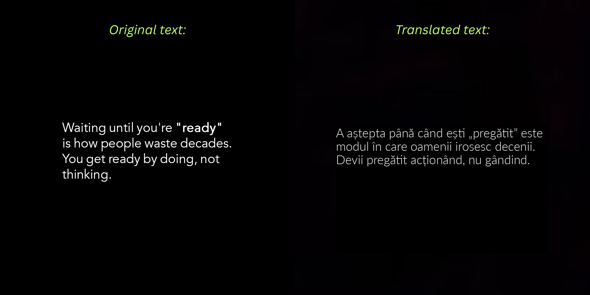

# Instagram OCR Translator 🤖📱

> **Work in Progress** - Personal automation project

An Instagram bot that automatically downloads posts, extracts and translates text using OCR and AI, then reposts with translated content. Built with Python, OpenAI API, and automated deployment.

## 🎯 Project Status

**🟢 Currently Live & Running**

- Bot is actively posting content
- Follow the live project: [Instagram: @minte.motivata](https://instagram.com/minte.motivata)
- Original page: [Instagram: @motivated.mindset](https://instagram.com/motivated.mindset)
- 4 automated posts and 2 stories daily with smart scheduling

---

## 🖼️ Project Showcase

Here is the flow:

### 1. Download and create posts

- Project downloads and creates posts everyday at **09:00AM** (Scheduled using _cron_ jobs)
- A mobile notification is sent if the process is successful

- **Original vs Created Post:**

### 2. Upload posts

- After creating the posts, the bot uploads 4 posts at randomized intervals (0-4 hours) to mimic human behavior
- A mobile notification is sent for each time a post has been uploaded successfully

## ✨ Other Features

- **🎯 Content Filtering**: Skips carousels, videos, and low-quality images
- **📊 Session Management**: Persistent Instagram authentication
- **📈 Comprehensive Logging**: Detailed operation tracking and error handling
- **🔄 Automated Deployment**: Shell scripts for seamless execution

### Libraries used

- **Instaloader, Instagrapi** - Instagram API integration
- **OpenAI API** - GPT-4 for intelligent translation
- **Tesseract OCR** - Text extraction from images
- **PIL (Pillow)** - Image processing and manipulation

## 🎯 Planned Improvements

- **Host Project:** Self-host project on a Raspberry Pi 5 so it's not on my laptop
- **Enhanced OCR:** Implement better OCR engines for better accuracy
- **Improved formatting:** Maintain text formatting from original image
- **Add Multi-language Support** (Only supports Romanian for now)
- **Dashboard:**: Add a monitoring interface
- **Plug-and-play:** Make project easier to clone and play around with it

## 📈 Impact & Results

- **Automated Workflow**: Reduced manual posting time by 100%
- **Consistent Content**: 4 daily posts with zero downtime
- **Quality Translation**: Professional-grade Romanian translations
- **Engagement Growth**: Steady follower increase through consistent posting

## 🤝 Contributing

This is a personal project showcasing automation and AI integration skills. Feel free to explore the code and suggest improvements!

**⭐ Star this repository if you found it interesting!**

_This project demonstrates practical application of AI, automation, and full-stack development skills_

